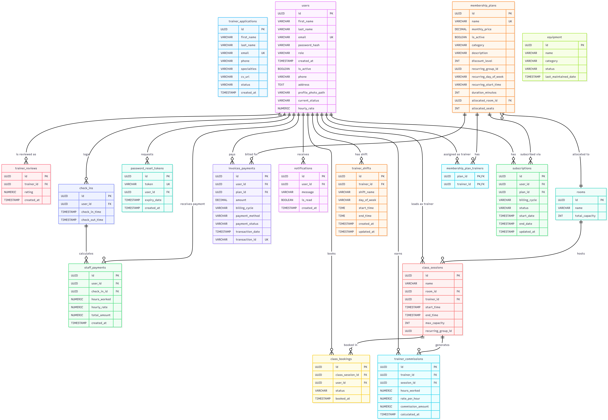

# Vortex Gym — Enterprise Management System


---

## Project Overview

Vortex Gym is a centralized, full-stack enterprise gym management system where administrators oversee facility operations, and members utilize a 100% self-service portal for onboarding, class booking, and payments. The platform allows owners to carefully manage facility resources, subscription lifecycles, and trainer schedules to prevent overlaps and optimize revenue. The system includes dynamic, database-driven elements, such as automated class waitlisting, touchless QR attendance verification, real-time trainer shift validation, and SQL-automated payroll computations.

---

## High-Level System Modules & Features

The system is categorized into five core business modules, distributed dynamically via a strict Role-Based Access Control (RBAC) architecture to meet the specific needs of Members, Trainers, Staff, and Admins.

### 1. Acquisition & Onboarding
- **100% Self-Service Member Enrollment**: Frictionless onboarding allowing new users to scan a QR code at the facility, select a membership tier, and securely check out. The system instantly provisions an active digital entry pass without any staff intervention.
- **Automated Trainer Recruitment Pipeline**: A staged application portal where prospective trainers upload credentials. Upon administrative approval, the system automatically provisions their employee profile, assigns global roles, and triggers onboarding communications.

### 2. Access Control & Daily Operations
- **Digital Bouncer (Automated Check-In)**: Members scan their digital barcodes at front-desk turnstiles. The system verifies active subscription states in milliseconds, triggering visual access indicators for the staff.
- **The Staff Live Monitor**: Front desk clerks operate as floor managers using iPads linked to real-time WebSocket check-in feeds, enabling them to troubleshoot and assist members proactively.

### 3. Scheduling & Capacity Management
- **Bulletproof Master Scheduling**: Administrative grids assigning trainers and rooms instantly. The system proactively blocks impossible double-bookings and prevents trainers from being scheduled outside their contracted hours.
- **Dynamic Member Bookings & Auto-Waitlists**: Members join classes directly via their mobile dashboard. If a room hits maximum capacity, overflow members are rolled smoothly onto a dynamic waitlist and auto-promoted when spots free up.
- **Trainer PT Portals**: Trainers utilize mobile-friendly portals to log attendance rosters and record detailed 1-on-1 personal training metrics (weights, reps, private notes) directly into their clients' profiles.

### 4. Facility Maintenance
- **Real-Time Equipment Health Tracking**: An internal ticketing system for floor staff to immediately flag malfunctioning equipment via mobile dashboards, instantly alerting administrative command centers for vendor dispatch.

### 5. Administration & Analytics
- **Financial & Operations Command Center**: High-level dashboards for business owners detailing Monthly Recurring Revenue (MRR), Peak Gym Hour utilization, and Trainer Popularity metrics, entirely parsed from perfectly-synchronized raw transaction data.

---

## Technical Highlights

While the modules above define the *user experience*, the architecture powering them is deeply engineered for flawless execution.

### Advanced Database Architecture (PostgreSQL)
Instead of relying on standard CRUD operations and backend logic loops, this system utilizes internal SQL capabilities to guarantee data supremacy:
- **Intelligent SQL Triggers**: Custom triggers intercept `INSERT`/`UPDATE` calls to automate business flows natively. For example, a subscription's status is flipped to `ACTIVE` the exact millisecond its corresponding invoice row registers as `SUCCESS`.
- **Constraint Engines**: If an Admin attempts to schedule a class, a `BEFORE INSERT` trigger seamlessly queries the `trainer_shifts` table and immediately rejects the API commit if it violates that specific trainer's working hours.
- **Automated Sync & Payroll**: Database triggers intercept check-out timestamps, cross-reference them with employee hourly rates, and instantly compile payroll totals natively, eliminating the need for fragile application-layer CRON jobs.

### Secure Financial & Hardware Integrations
- **SSL Commerz Integration**: Directly embedded e-commerce payment gateway tracking invoices seamlessly between Sandbox and Production states.
- **Touchless QR Optic Check-In**: Powered by `react-qr-code` and `react-qr-scanner`, the system encrypts Member UUIDs into dynamic, time-sensitive optics that are decrypted instantly at physical front-desk terminals.

### Real-Time Communication Layers
- **JavaMail SMTP**: Connects natively to dispatch automated, transactional emails for payment receipts, waitlist promotions, and zero-staff password recovery.
- **WebSockets**: Providing real-time, bidirectional HTTP updates to iPads across the gym floor without relying on expensive frontend polling.

---

## Technology Stack

### Backend Infrastructure
- **Java 21 & Spring Boot 3**: Robust REST API ecosystem (WebMVC, Data JPA, Validation).
- **PostgreSQL 14+**: Complex relational database supporting custom Stored Procedures and Triggers.
- **Flyway DB Migration**: Strictly versioned sequential database migrations (`V1__` through `V15__` logic maps).
- **MapStruct & Lombok**: Automated DTO mapping and extreme reduction of Java boilerplate.
- **Spring Boot Mail & WebSockets**: Enabling cross-platform communication and real-time alerts.
- **SSL Commerz SDK**: Hosted payment gateway sandbox integration for regional banking support.

### Frontend Application
- **React.js 19 (Vite)**: Instantly loading, highly optimized SPA interface.
- **Tailwind CSS v4**: Ultra-modern, responsive utility styling architecture.
- **Axios & React Router DOM**: Configured API service layers containing embedded interceptors for JWT routing.
- **Recharts**: Rendering statistical visual analytics for Admin Command Centers.
- **Date-Fns**: Comprehensive, timezone-aware datetime manipulation.
- **Cypress**: E2E testing environments confirming front-to-back functionality.

---

## Setup & Configuration Guide

### 1. Database & SMTP Configuration (`application.yaml`)
To spin up Vortex Gym locally, you must provide your personalized secrets securely. Navigate to the central config file:
`enterprise-system/src/main/resources/application.yaml`

Modify these core blocks to match your credentials:

```yaml
# 1. PostgreSQL Database Config
spring:
  datasource:
    url: jdbc:postgresql://localhost:5432/gym_db # Standard port
    username: postgres # Your local postgres user
    password: your_secret_password # Your local DB password

# 2. Gmail SMTP Server (Requires Google App Password)
  mail:
    host: smtp.gmail.com
    port: 587
    username: your.email@gmail.com
    password: your_generated_app_password # Do NOT use standard password; Create an "App Password" in Google Account Settings > Security

# 3. SSL Commerz Payment Gateway (Sandbox/Dev)
sslcommerz:
  store-id: your_sandbox_store_id
  store-password: your_sandbox_store_password@ssl
  base-url: https://sandbox.sslcommerz.com # Toggle to securepay.sslcommerz.com for Prod
```

### 2. Backend Initialization
The backend utilizes Flyway. The moment Spring Boot launches, it will seamlessly create tables, seed data, and establish the custom triggers automatically.

```bash
cd enterprise-system
./mvnw clean install -DskipTests
./mvnw spring-boot:run
```
*The Spring Boot server will spin up on `http://localhost:8080`. API endpoints become fully accessible.*

### 3. Frontend Initialization
```bash
cd frontend
npm install --legacy-peer-deps
npm run dev
```
*Vite will compile in milliseconds and provide the Client Dashboard at `http://localhost:5173`. Authentication and analytics panels are immediately bound via APIs.*

---

## Database Design Strategy
The relational integrity of the system maps across 18 specialized tables, utilizing UUID primary keys, high-level foreign boundary constraints, and cascading rules preventing orphan data fragmentation.



> **Key takeaway**: I developed this architecture specifically to maintain complete internal consistency at the database level, rendering the software immune to unexpected backend race conditions or UI errors.
